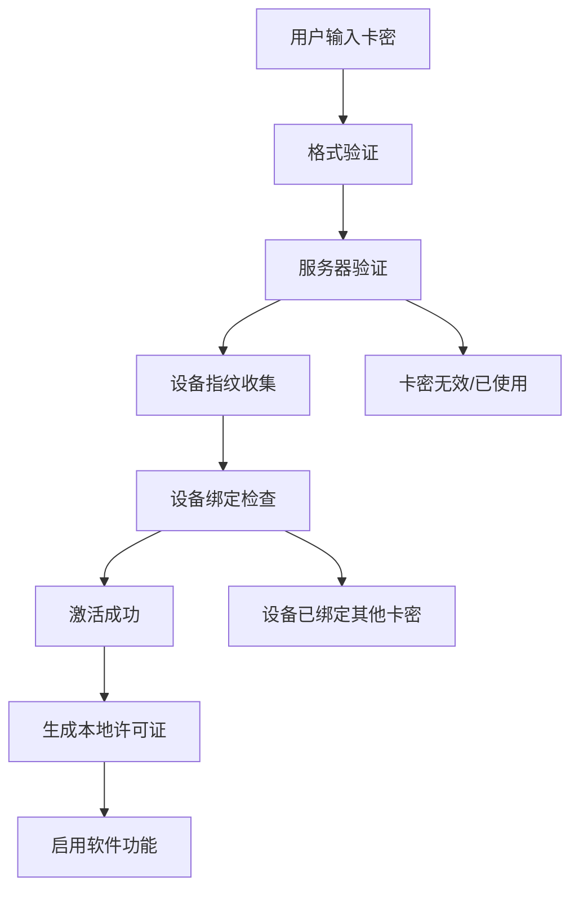
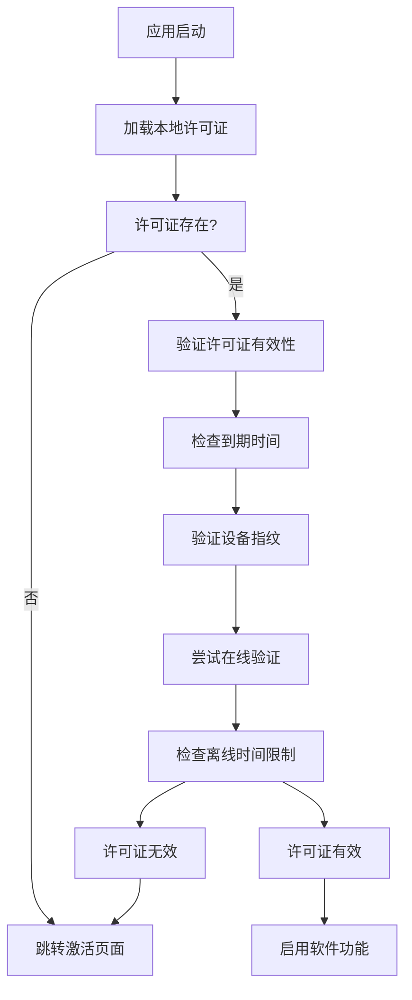

# 光子矩阵 - 线下付费模式和登录系统

## 📋 系统概述

本认证系统实现了完整的线下卡密销售模式，包括卡密生成、激活验证、设备绑定、权限控制等功能，确保软件的商业化运营和安全防护。

## 🏗️ 系统架构

```
┌─────────────────┐    ┌─────────────────┐    ┌─────────────────┐
│   客户端应用    │ ←→ │   认证服务器    │ ←→ │   SQLite数据库  │
│  (Electron)     │    │  (本地/云端)    │    │   (卡密管理)    │
└─────────────────┘    └─────────────────┘    └─────────────────┘
         │                       │                       │
         ▼                       ▼                       ▼
┌─────────────────┐    ┌─────────────────┐    ┌─────────────────┐
│   设备指纹      │    │   许可证验证    │    │   使用统计      │
│   硬件绑定      │    │   在线/离线     │    │   代理商管理    │
└─────────────────┘    └─────────────────┘    └─────────────────┘
```

## 💳 卡密体系设计

### 卡密格式
```
HSAI-XXXX-XXXX-XXXX-XXXX
│    │    │    │    │
│    │    │    │    └─ 校验码 (4位)
│    │    │    └────── 随机码 (4位)
│    │    └─────────── 年份码 (4位)
│    └──────────────── 套餐码 (4位)
└───────────────────── 产品标识
```

### 套餐类型
| 套餐 | 账号数 | 月价 | 季价(8.5折) | 年价(7折) |
|------|--------|------|-------------|-----------|
| 入门版 | 10个 | ¥3,000 | ¥7,650 | ¥25,200 |
| 标准版 | 20个 | ¥5,600 | ¥14,280 | ¥47,040 |
| 专业版 | 50个 | ¥12,500 | ¥31,875 | ¥105,000 |
| 企业版 | 100个 | ¥22,000 | ¥56,100 | ¥184,800 |

## 🔐 认证流程

### 1. 卡密激活流程


### 2. 许可证验证流程


## 📁 文件结构

```
hs7/
├── auth/                           # 认证系统目录
│   ├── database.js                 # SQLite数据库管理
│   ├── device-fingerprint.js       # 设备指纹收集
│   ├── license-manager.js          # 许可证管理器
│   ├── card-generator.js           # 卡密生成器
│   ├── security-protection.js      # 安全防护
│   ├── auth.db                     # SQLite数据库文件
│   └── license.dat                 # 加密的许可证文件
├── auth-activation.html            # 卡密激活页面
├── auth-status.html                # 会员状态页面
├── admin-panel.html                # 管理后台页面
├── auth-checker.js                 # 前端认证检查
├── main.js                         # 主进程(已集成认证API)
├── preload.js                      # 预加载脚本(已添加认证API)
└── 认证系统使用说明.md              # 本文档
```

## 🔧 功能模块

### 1. 数据库模块 (`auth/database.js`)
- **功能**: SQLite数据库操作
- **表结构**:
  - `card_keys`: 卡密信息表
  - `devices`: 设备信息表
  - `agents`: 代理商信息表
  - `usage_logs`: 使用记录表
  - `system_config`: 系统配置表

### 2. 设备指纹模块 (`auth/device-fingerprint.js`)
- **功能**: 收集设备硬件信息生成唯一指纹
- **收集信息**:
  - CPU型号和数量
  - 内存大小
  - 网络接口MAC地址
  - 主板序列号(Windows)
  - 硬盘序列号
  - 系统UUID

### 3. 许可证管理器 (`auth/license-manager.js`)
- **功能**: 许可证验证和管理
- **特性**:
  - 卡密激活和验证
  - 设备绑定管理
  - 在线/离线验证
  - 心跳检测机制
  - 本地许可证加密存储

### 4. 卡密生成器 (`auth/card-generator.js`)
- **功能**: 批量生成和管理卡密
- **特性**:
  - 单个/批量生成
  - 预设套餐生成
  - 统计和报表
  - CSV导出功能

### 5. 安全防护模块 (`auth/security-protection.js`)
- **功能**: 反调试和反破解
- **防护措施**:
  - 调试器检测
  - 可疑进程检测
  - 网络连接监控
  - 文件完整性检查
  - 虚拟机环境检测
  - 内存补丁检测

## 🎯 使用指南

### 管理员操作

#### 1. 生成卡密
```javascript
// 访问管理后台
window.location.href = 'admin-panel.html';

// 快速生成10张月卡
const config = {
    packageType: '10',
    accountCount: 10,
    durationDays: 30,
    price: 3000,
    quantity: 10,
    agentId: 'admin'
};
await window.electronAPI.generateCardKeys(config);
```

#### 2. 查询卡密状态
```javascript
// 查询特定卡密
const result = await window.electronAPI.getCardDetails('HSAI-10M1-24M1-A8F3-9C7E');

// 获取使用统计
const stats = await window.electronAPI.getUsageStatistics();
```

### 用户操作

#### 1. 激活软件
```html
<!-- 访问激活页面 -->
<script>window.location.href = 'auth-activation.html';</script>
```

#### 2. 查看会员状态
```html
<!-- 访问状态页面 -->
<script>window.location.href = 'auth-status.html';</script>
```

#### 3. 检查功能权限
```javascript
// 检查发布权限
const permission = await window.electronAPI.checkFeaturePermission('auto_publish');
if (permission.allowed) {
    // 执行发布操作
} else {
    // 显示权限不足提示
}
```

## 🔒 安全机制

### 1. 设备绑定
- 每个卡密只能绑定一台设备
- 设备指纹包含多项硬件信息
- 硬件重大变化会触发重新验证

### 2. 在线验证
- 定期心跳检测(默认6小时)
- 服务器端状态同步
- 异常使用行为监控

### 3. 离线保护
- 最大离线时间限制(默认7天)
- 本地许可证加密存储
- 设备指纹验证

### 4. 反破解保护
- 调试器检测和防护
- 可疑进程监控
- 代码完整性验证
- 虚拟机环境检测

## 📊 销售体系

### 代理商分级
```
总代理商 (拿货6折)
├── 区域独家代理权
├── 月销售任务: 50万+
└── 销售支持和培训

二级代理商 (拿货7折)
├── 地市级代理权
├── 月销售任务: 20万+
└── 总代理商管理

零售商/个人代理 (拿货8折)
├── 无区域限制
├── 月销售任务: 5万+
└── 二级代理商发展
```

### 销售管理
- 卡密批量生成和分发
- 销售数据统计
- 佣金结算管理
- 库存管理
- 业绩排行榜

## 🚀 部署指南

### 1. 安装依赖
```bash
npm install crypto node-machine-id sqlite3 bcrypt axios uuid
```

### 2. 数据库初始化
```javascript
// 数据库会在首次运行时自动创建
const AuthDatabase = require('./auth/database');
const db = new AuthDatabase();
```

### 3. 生成初始卡密
```javascript
// 在管理后台生成预设套餐
const cardGenerator = new CardGenerator();
await cardGenerator.generatePresetPackages();
```

### 4. 配置服务器地址
```javascript
// 在system_config表中配置服务器地址
await db.setConfig('server_url', 'https://auth.photonmatrix.com');
```

## 🛠️ API 参考

### 前端API
```javascript
// 激活卡密
await window.electronAPI.activateCardKey(cardKey);

// 验证许可证
await window.electronAPI.validateLicense();

// 获取许可证状态
await window.electronAPI.getLicenseStatus();

// 检查功能权限
await window.electronAPI.checkFeaturePermission(featureName);

// 获取设备信息
await window.electronAPI.getDeviceInfo();

// 生成卡密(管理员)
await window.electronAPI.generateCardKeys(config);
```

### 后端IPC处理
```javascript
// main.js中已实现所有IPC处理器
ipcMain.handle('activate-card-key', async (event, cardKey) => { ... });
ipcMain.handle('validate-license', async () => { ... });
ipcMain.handle('get-license-status', async () => { ... });
// ... 更多处理器
```

## 📈 监控和统计

### 关键指标
- 卡密生成/激活数量
- 用户活跃度统计
- 功能使用频率
- 异常行为检测
- 收入统计分析

### 日志记录
- 激活记录
- 使用行为日志
- 安全事件日志
- 系统错误日志

## 🔧 故障排除

### 常见问题

#### 1. 激活失败
- 检查卡密格式是否正确
- 确认卡密未被使用
- 验证网络连接状态
- 检查设备是否已绑定其他卡密

#### 2. 许可证验证失败
- 检查本地许可证文件
- 验证设备指纹变化
- 确认在线验证服务可用
- 检查离线时间是否超限

#### 3. 功能权限不足
- 确认许可证状态正常
- 检查套餐类型权限
- 验证账号数量限制

### 调试工具
```javascript
// 获取详细错误信息
const validation = await window.electronAPI.validateLicense();
console.log('验证结果:', validation);

// 查看设备信息
const deviceInfo = await window.electronAPI.getDeviceInfo();
console.log('设备信息:', deviceInfo);

// 检查安全状态
const security = securityProtection.generateSecurityReport();
console.log('安全报告:', security);
```

## 📞 技术支持

### 联系方式
- **QQ群**: 123456789
- **微信**: photonmatrix2024
- **邮箱**: support@photonmatrix.com
- **电话**: 400-123-4567

### 工作时间
- 周一至周日 9:00-18:00
- 紧急情况24小时支持

---

## 📝 更新日志

### v1.0.1 (2024-12-19)
- ✅ 完整的卡密激活系统
- ✅ 设备绑定和指纹识别
- ✅ 在线/离线许可证验证
- ✅ 管理后台和统计功能
- ✅ 安全防护和反破解机制
- ✅ 完整的用户界面和体验

### 未来计划
- 🔄 云端服务器部署
- 🔄 移动端管理应用
- 🔄 高级分析和报表
- 🔄 自动化代理商管理
- 🔄 多语言支持

---

**© 2024 光子矩阵团队 - 保留所有权利**